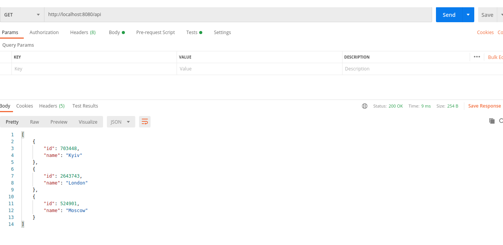
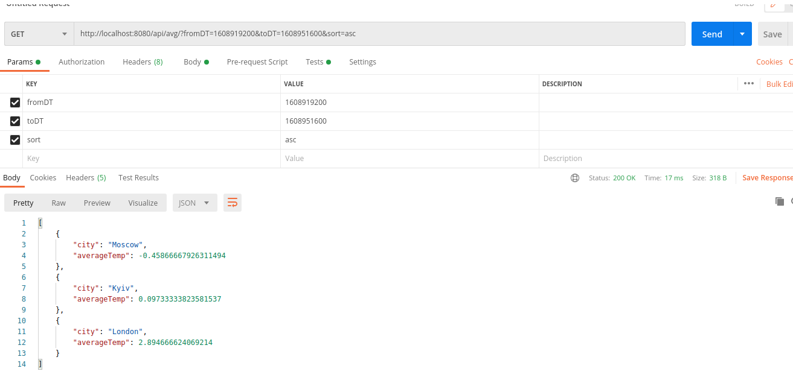
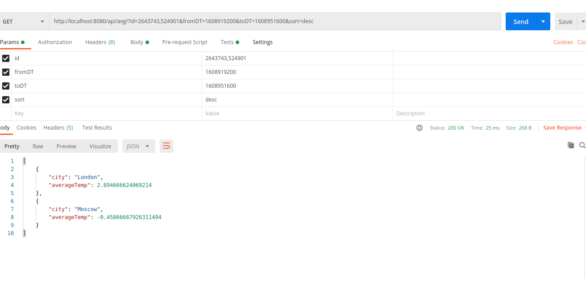

# OpenWeatherForecastApi

Spring Boot app using OpenWeatherMap forecast API to show average temperatures for given cities in selected time
intervals.

Before running application from IDE or cmd line make sure to run Postgres Docker container:

```
docker run --name my-postgres-container -e POSTGRES_PASSWORD=mysecretpassword -p 5432:5432 -d postgres:13.1-alpine
```
Check that Flyway created tables and populated city table in postgres public schema with .sql script from main/resources/db.migration by entering Postgres container :

```
  docker exec -it my-postgres-container bash
  
  psql -U postgres
  
  \dt
  
  select * from city;
```

Swagger docs are on default adress :  http://localhost:8080/swagger-ui.html

On application startup @PostConstruct method makes calls to API, takes data and persists it into temperature table.
Data can be seen in postgres  with "select * from temperature;" inside container.

First endpoint gets all cities from database:



Second endpoint returns projection of cities and their average temperatures for given time periods.
In absence of cityId parameters, it fetches data for all cities. If no paramteter is provided for sort, results are sorted in descending order
from highest avg temp to lowest by default. Otherwise by given parameter.



For given IDs of cities request and response look like this:



## TODO:

Improve output format of avg temperatures to two decimals.

Probably possible to refactor to less DTOs.

Application could support other more readable dateTime formats and maybe allow users to insert city names instead of IDs.

While application has only two endpoints and both are GET which don't provide much room for crashing (first endpoint accepts no inputs 
and 2nd has SQL Query which adapts to null or invalid id-s and timestamps), it would be nice to provide customExceptions/@ControolerAdvice handler. 
